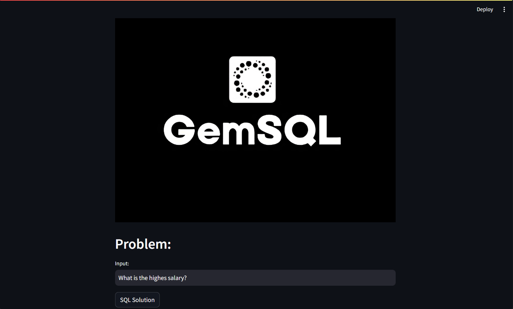
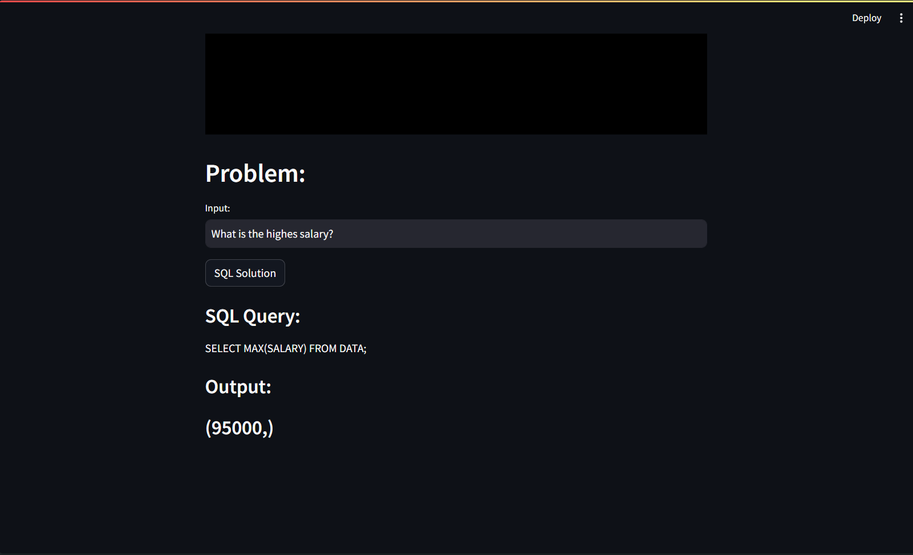

## GemSQL 
### Generate and get outputs for given "data.db" file using Gemini API as base  

This project seamlessly translates human-readable text queries into SQL queries by utilizing Google's Gemini Pro's sophisticated natural language processing capabilities. The Gemini Pro engine converts user-inputted plain English questions into structured SQL queries through an intuitive interface, thereby simplifying the process of interacting with databases. This tool makes database querying more accessible and efficient by converting text queries into actionable SQL commands, whether you're a developer, data analyst, or just looking to streamline database interactions.

## Run Locally

Clone the project

```bash
  git clone https://github.com/HavaleShreyash/GemSQL.git
```

Go to the project directory

```bash
  cd GemSQL

```

Install dependencies

```bash
  pip install -r requirements.txt
```

Run the model

```bash
  streamlit run app.py
```

## Dependencies
    Streamlit
    Sqlite3
    Python
    python-dotenv
    Google GenerativeAI

## Usage Tips
Use the database only with file name "DATA.db"

## Architecture


## User Interface and Results



